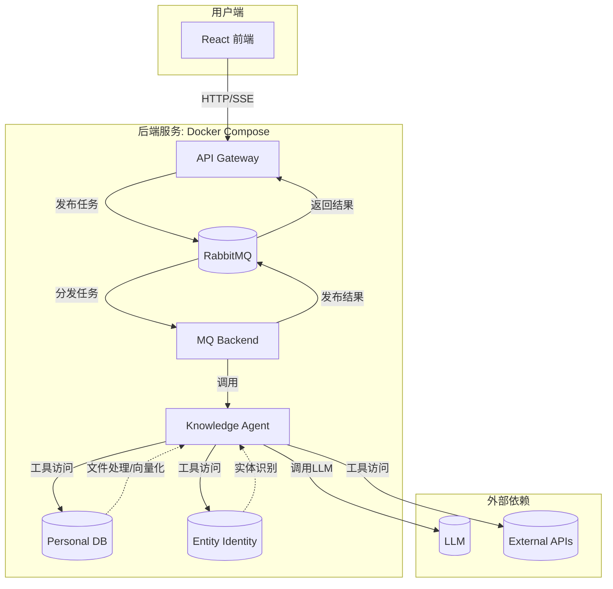

# LangGraph Agentic RAG with Streaming

[](https://react.dev/) [](https://www.python.org/) [](https://www.docker.com/) [](https://langchain-ai.github.io/langgraph/)

一个基于 **LangGraph**、**Google A2A 协议** 和 **微服务架构** 构建的智能 RAG Agent 系统。本项目前后端分离，通过 **Docker Compose** 实现一键部署，为用户提供具备实时思考过程展示、多轮对话、流式响应和来源追溯的先进交互体验。


---

## 核心功能

- **流式交互体验**: Agent 的每一个思考步骤、工具调用、Token 生成都通过 SSE (Server-Sent Events) 实时推送到前端，提供极致的透明度和流畅的用户体验。
- **来源可追溯 (RAG)**: Agent 的回答不仅包含最终答案，还明确标注了信息来源，确保了内容的可信度和可验证性。
- **实体关联查询**: 自动识别回答中的实体（如：疾病、药品），并进行关联知识库查询，丰富回答内容。
- **多轮对话记忆**: 基于 A2A 协议的会话管理，支持上下文记忆，能够进行连贯的多轮对话。
- **可插拔组件 (MCP)**: 支持 MCP (Modular Cog-Psy) 协议，可以方便地将外部工具或服务作为插件集成到 Agent 中。
- **微服务架构**: 后端采用高度解耦的微服务设计，通过 RabbitMQ 进行异步通信，保证了系统的高可用、高并发和可扩展性。
- **多数据源支持**: 可灵活切换知识库、数据库等不同数据源。

---

## 系统架构

本系统采用前后端分离的微服务架构，各服务职责明确、独立部署，通过 RabbitMQ 消息队列进行解耦和异步通信。



- **Frontend**: React + Vite 构建的现代化用户界面，通过 SSE 实时渲染后端推送的各种事件。
- **API Gateway**: 系统的统一入口，负责接收前端请求、管理 SSE 连接，并通过 RabbitMQ 将任务分发给后端。
- **MQ Backend**: 消费任务队列，调用核心 Agent 服务，并将处理结果（包括中间步骤）发回结果队列。
- **Knowledge Agent**: 核心智能代理，基于 LangGraph 构建，负责推理、工具调用和生成回答。
- **Personal DB**: 个人知识库服务，负责文件的读取、解析、向量化，并存入向量数据库。
- **Entity Identity**: 实体识别服务，用于从文本中识别出特定类型的实体。
- **RabbitMQ**: 消息代理，作为服务间的缓冲和解耦层，实现系统的异步化和高并发。

---

## 快速开始

推荐使用 Docker Compose 进行一键部署。

### 1. 环境准备

- 安装 [Docker](https://www.docker.com/get-started) 和 [Docker Compose](https://docs.docker.com/compose/install/)。
- 克隆本项目到本地。

### 2. 配置环境变量

本项目中的每个后端服务都有独立的 `env_template` 文件。您需要根据您的环境，为 **每个** 服务创建 `.env` 文件。

例如，为 `knowledge_agent` 服务进行配置：
```bash
cp backend/knowledge_agent/env_template backend/knowledge_agent/.env
```
然后编辑 `backend/knowledge_agent/.env` 文件，填入您的 `GOOGLE_API_KEY` 等信息。

**请重复此步骤，为 `api_gateway`、`mq_backend`、`entity_identity` 和 `personal_db` 等所有后端服务创建并配置 `.env` 文件。**

### 3. 启动后端服务

在项目根目录下，执行以下命令：

```bash
docker-compose up --build -d
```
此命令会构建并以后台模式启动所有后端服务。

### 4. 启动前端

```bash
cd frontend
npm install
npm run dev
```
启动成功后，即可在浏览器中打开 `http://localhost:5173` (或其他指定端口) 开始使用。


# 手动安装
1. 创建python环境， 安装依赖
```
conda env create langgrapha2a
conda activate langgrapha2a
cd backend/api_gateway
pip install -r requirements.txt
cd backend/knowledge_agent
pip install -r requirements.txt
cd backend/entity_identity
pip install -r requirements.txt
cd backend/mq_backend
pip install -r requirements.txt
cd backend/personal_db
pip install -r requirements.txt
```

2.创建Rabbit MQ
```
docker run -d --hostname rabbitapp --name rabbitapp -e RABBITMQ_DEFAULT_USER=admin -e RABBITMQ_DEFAULT_PASS=welcome -p 4369:4369 -p 5671:5671 -p 5672:5672 -p 25672:25672 -p 15671:15671 -p 15672:15672 -p 15691:15691 -p 15692:15692 rabbitmq:3-management
```
3. 创建vhost
```mermaid
python script create_vhost.py
```
4. 启动每个后台
```
cd backend/api_gateway
python main.py
cd backend/knowledge_agent
python main.py
cd backend/entity_identity
python entity_main.py
cd backend/mq_backend
python MQ_ii_main_api.py
cd backend/personal_db
python main.py
```
5. 前端启动
```bash
cd frontend
npm install
npm run dev
```
启动成功后，即可在浏览器中打开 `http://localhost:5173`开始使用。


# 自定义langgraph工具和MCP工具
修改[tools.py](backend%2Fknowledge_agent%2Ftools.py)文件和创建[mcp_config.json](backend%2Fknowledge_agent%2Fmcp_config.json)

---

## 技术栈

- **前端**: React, Vite, Tailwind CSS, TypeScript
- **后端**: Python, FastAPI, LangChain, LangGraph, Pika (RabbitMQ Client)
- **数据库**: ChromaDB (用于向量存储)
- **基础设施**: Docker, RabbitMQ
- **核心协议**: Google A2A, SSE, MCP

---

## 路线图 (Roadmap)

- [x] 工具元数据 (Tool Metadata)
- [x] 元数据返回 (Metadata Return)
- [x] Agent 步骤流式返回 (Step Streaming)
- [x] LLM Token 流式返回 (Token Streaming)
- [x] MCP 即插即用集成 (MCP Integration)
- [x] 工具动态切换 (Dynamic Tool Switching)
- [x] LLM 思考过程返回 (LLM Thinking Return)
- [x] 实现 Plan-and-Execute Agent 模式
- [ ] 将 [gemini-fullstack-langgraph-quickstart](https://github.com/google-gemini/gemini-fullstack-langgraph-quickstart) 改造为 A2A 形式

---

## 联系方式

