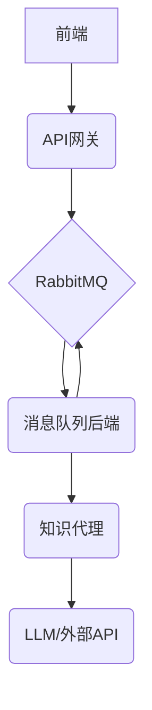

# 后端架构

  本项目的后端采用微服务架构，由三个核心服务组成：API网关、消息队列后端 和 知识代理。这种设计旨在实现关注点分离、提高系统的可伸缩性和鲁棒性。

  设计理念：为什么选择三个后端服务？

  将后端拆分为三个独立的服务，主要基于以下几点考虑：

1. 解耦与异步处理：
    * API网关 (`api_gateway`) 作为前端的直接入口，负责请求的接收和校验。它将任务发布到消息队列后即可立即响应前端，避免了
      长时间的HTTP等待，提升了用户体验。
    * 消息队列 (`mq_backend`) 作为中间件，起到了缓冲和解耦的关键作用。它允许重量级的任务（如与LLM的交互）在后台异步处理
      ，而不会阻塞API网关。这种异步处理机制使得系统能够轻松应对突发流量，提高了整体的吞吐量。

2. 可伸缩性：
    * 每个服务都可以根据其具体负载进行独立扩展。例如，如果处理LLM任务的 知识代理 (`knowledge_agent`)
      成为瓶颈，我们可以独立地增加该服务的实例数量，而无需改动其他服务。同样，如果API请求量巨大，也可以横向扩展
      API网关。

3. 职责单一与可维护性：
    * API网关 只关心与前端的通信和消息的发布。
    * 消息队列后端 专注于从队列中消费任务、调用代理并将结果回传。
    * 知识代理 则完全封装了与LangGraph和LLM交互的复杂逻辑。
    * 这种明确的职责划分使得每个服务的代码都更简洁、更易于理解和维护。

4. 异构技术栈的灵活性：
    * 虽然目前所有服务都使用Python，但这种微服务架构允许未来在不同的服务中使用最适合其功能的技术栈，而不会相互影响。

1. API网关 (api_gateway)

* 职责: 作为系统的统一入口，负责处理来自前端的HTTP请求。它会将接收到的任务（例如，用户的查询）封装成消息，并发布到Rabbit
  MQ消息队列中。
* 技术: FastAPI
* 更多详情... (api_gateway/README.md)

2. 消息队列后端 (mq_backend)

* 职责: 监听RabbitMQ队列中的新任务。一旦接收到任务，它会调用 知识代理 服务来处理该任务。处理完成后，它负责将结果发送回Ra
  bbitMQ的另一个通道，以供需要的地方（例如，通过WebSocket通知前端）消费。
* 技术: Pika (RabbitMQ Python client)
* 更多详情... (mq_backend/README.md)

3. 知识代理 (knowledge_agent)

* 职责: 这是后端的核心业务逻辑所在。它使用LangGraph和大型语言模型（LLM）来理解和响应用户的查询。该服务通过A2A协议暴露，
  支持多轮对话、流式响应和会话记忆。
* 技术: LangGraph, A2A Protocol
* 更多详情... (knowledge_agent/README.md)
