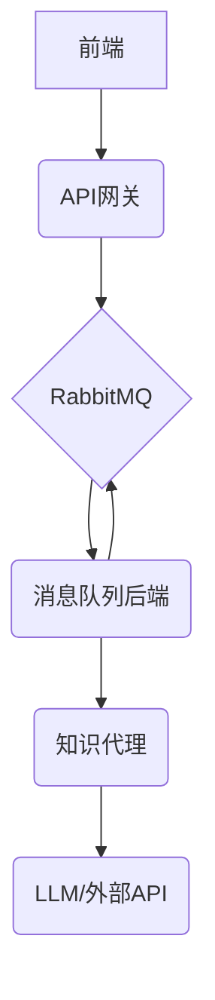

# 后端架构

  本项目的后端采用微服务架构，由三个核心服务组成：API网关、消息队列后端 和 知识代理。这种设计旨在实现关注点分离、提高系统的可伸缩性和鲁棒性。

  设计理念：为什么选择三个后端服务？

  将后端拆分为三个独立的服务，主要基于以下几点考虑：

1. 解耦与异步处理：
    * API网关 (`api_gateway`) 作为前端的直接入口，负责请求的接收和校验。它将任务发布到消息队列后即可立即响应前端，避免了
      长时间的HTTP等待，提升了用户体验。
    * 消息队列 (`mq_backend`) 作为中间件，起到了缓冲和解耦的关键作用。它允许重量级的任务（如与LLM的交互）在后台异步处理
      ，而不会阻塞API网关。这种异步处理机制使得系统能够轻松应对突发流量，提高了整体的吞吐量。

2. 可伸缩性：
    * 每个服务都可以根据其具体负载进行独立扩展。例如，如果处理LLM任务的 知识代理 (`knowledge_agent`)
      成为瓶颈，我们可以独立地增加该服务的实例数量，而无需改动其他服务。同样，如果API请求量巨大，也可以横向扩展
      API网关。

3. 职责单一与可维护性：
    * API网关 只关心与前端的通信和消息的发布。
    * 消息队列后端 专注于从队列中消费任务、调用代理并将结果回传。
    * 知识代理 则完全封装了与LangGraph和LLM交互的复杂逻辑。
    * 这种明确的职责划分使得每个服务的代码都更简洁、更易于理解和维护。

4. 异构技术栈的灵活性：
    * 虽然目前所有服务都使用Python，但这种微服务架构允许未来在不同的服务中使用最适合其功能的技术栈，而不会相互影响。

1. API网关 (api_gateway)

* 职责: 作为系统的统一入口，负责处理来自前端的HTTP请求。它会将接收到的任务（例如，用户的查询）封装成消息，并发布到Rabbit
  MQ消息队列中。
* 技术: FastAPI
* 更多详情... (api_gateway/README.md)

2. 消息队列后端 (mq_backend)

* 职责: 监听RabbitMQ队列中的新任务。一旦接收到任务，它会调用 知识代理 服务来处理该任务。处理完成后，它负责将结果发送回Ra
  bbitMQ的另一个通道，以供需要的地方（例如，通过WebSocket通知前端）消费。
* 技术: Pika (RabbitMQ Python client)
* 更多详情... (mq_backend/README.md)

3. 知识代理 (knowledge_agent)

* 职责: 这是后端的核心业务逻辑所在。它使用LangGraph和大型语言模型（LLM）来理解和响应用户的查询。该服务通过A2A协议暴露，
  支持多轮对话、流式响应和会话记忆。
* 技术: LangGraph, A2A Protocol
* 更多详情... (knowledge_agent/README.md)

# 系统是如何利用 sessionId 实现会话隔离和并发的：

  1. 会话的创建与隔离 (在 api_gateway)

   1. 生成唯一ID: 当用户在前端发起一个新的聊天时，api_gateway 的 /chat 端点会立即执行 session_id =
      str(uuid4())。这为本次会话创建了一个全球唯一的标识符。

   2. 创建专属返回通道: 同时，api_gateway 会为这个 session_id 创建一个专属的、在内存中的异步队列
      (asyncio.Queue)，并将其存入一个全局字典中：sse_queues[session_id] =
      asyncio.Queue()。这个队列是该用户SSE连接的唯一数据来源。

   3. 标记请求: api_gateway 将用户的消息和这个新生成的 sessionId 打包成一个任务，发送到RabbitMQ的 question_queue。

  效果: 每个进入系统的请求都被打上了独一无二的烙印 (sessionId)，并且在网关层就建立好了只为它服务的返回通道。

  2. 任务的并发处理 (在 mq_backend)

   1. 消息队列解耦: RabbitMQ作为消息代理，它从 api_gateway 接收成千上万的请求。这些请求在队列中排队，api_gateway
      发送后无需等待，可以立即处理下一个前端请求，实现了入口的高并发。

   2. 多线程消费: mq_backend 使用了一个线程池 (ThreadPoolExecutor) 来消费 question_queue 中的消息。这意味着它可以同时处理多
      个不同的会话任务。如果队列里有10条消息（来自10个不同的用户），线程池会启动多个线程并行处理它们。

   3. 处理过程中的隔离: 每个线程处理一个消息时，会从中解析出 sessionId。它在调用 knowledge_agent 时，会将这个 sessionId
      传递过去。这保证了即使是LLM代理层，也能区分不同会话的上下文。

  效果:
  后端处理能力可以水平扩展。即使LLM处理速度较慢，也不会阻塞新请求的接收。每个任务都在自己独立的线程中处理，互不干扰。

  3. 响应的精确路由 (回到 api_gateway)

   1. 标记响应: mq_backend 在处理完一个任务（或获得一个流式数据块）后，会将结果连同原始的 `sessionId`
      一起，打包成响应消息，发送到 answer_queue。

   2. 统一监听，精确分发: api_gateway 中有一个后台线程，持续监听 answer_queue。当它收到一条响应消息时，它会：
      a.  解析消息，读取 sessionId。
      b.  使用这个 sessionId 作为钥匙，在 sse_queues 字典中找到对应的、专属的那个 asyncio.Queue。
      c.  将消息放入这个队列。

   3. 发送给正确的前端: 与该 sessionId 关联的那个SSE连接正在 await
      这个队列中的新数据。一旦数据被放入，它会立即被唤醒，并将数据发送给正确的那个用户的浏览器。

  效果: 即使成千上万条响应消息涌入 answer_queue，api_gateway
  也能像一个高效的分拣中心，准确无误地将每条消息分发给它唯一归属的前端连接。

  总结与图示

  这种设计将“会话状态”完全外化为 sessionId，服务本身是无状态的，从而实现了：

   * 隔离性 (Isolation): User A的响应绝不会被发送到User B的会话中，因为它们的 sessionId 不同。
   * 高并发 (Concurrency): 通过消息队列的缓冲和后端的多线程处理，系统可以同时处理大量请求。
   * 可伸缩性 (Scalability): 如果处理能力不足，可以独立地增加 mq_backend 的消费者实例数量，而无需改动其他部分。
